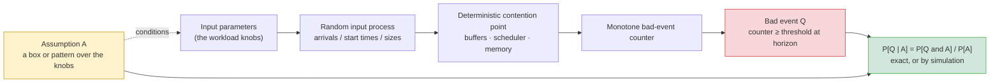
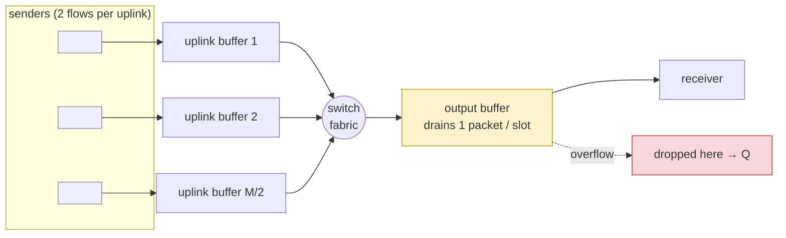
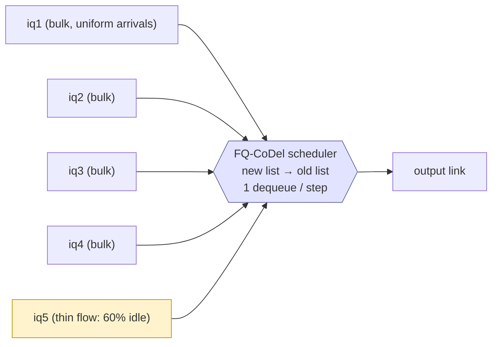
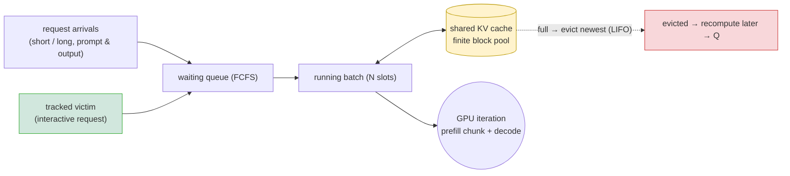

# Case studies: conditional probabilistic reasoning about contention points

*Draft — introductory framing plus one section per case study.*

## 1. The general theme

A network or system has places where many things compete for one shared resource.
A switch buffer that several links feed into. A scheduler that must pick one queue
to serve. A block of GPU memory that many requests share. We call these places
**contention points**. When too much input arrives at once, a contention point
misbehaves: it drops packets, it starves a flow, it evicts a request. We want to
reason about *when* this happens and *how likely* it is.

Testing does not answer this well. A single trace either hits the bad behavior or
it does not, and it tells you nothing about how common that trace is. A worst-case
bound is also unsatisfying: it usually describes an extreme input that a real
system would rarely produce. What an engineer actually wants to know is different.
It is a question about a *class* of inputs: "if the traffic looks roughly like
this, how often does the component break?"

We answer that question with a model and a probability. The recipe is the same in
every case study.

1. **Model the contention point as a discrete-time Markov chain (a DTMC).** We
   write it in [PRISM](https://www.prismmodelchecker.org/). The state is the
   contents of the buffers, queues, or memory, plus a clock.

2. **Put all the randomness in the input.** The only random choices in the model
   are in how the input arrives — when a sender starts, how many packets show up,
   whether the next request is long or short. Once the input is fixed, the
   component itself behaves deterministically: the buffer fills by fixed rules,
   the scheduler picks by fixed rules. This split is deliberate. It means every
   probability we compute is a statement about the *input*, not about hidden coin
   flips inside the hardware.

3. **Describe the input with a few named parameters.** These are the knobs of the
   workload: how many senders, how wide the arrival window, how long each burst,
   how likely a long request is. We call the whole vector of these knobs the input
   description.

4. **Define the bad event `Q` as a property of a run.** In every case study `Q` is
   read off a counter that only goes up (packets dropped, times a queue was
   skipped, times a request was evicted). Because the counter is monotone, "did
   the bad thing ever happen within the horizon" is just "is the counter over its
   threshold at the end." That makes `Q` easy and exact to state as a temporal
   property.

5. **Define an assumption `A` over the input parameters.** `A` is a condition on
   the input description. It can be a *box* — a range for each parameter, like "6
   to 12 senders, any window up to 48 slots, bursts of 16 to 24 packets" — or a
   *pattern* — "a long request arrived just before the one we care about." `A` is
   the thing we want to reason under.

6. **Compute the conditional probability `P[Q | A]`.** PRISM has no built-in
   "given" operator, so we compute it by division:

   ```
   P[Q | A]  =  P[Q and A]  /  P[A]
   ```

   Each query group is three numbers: the base rate `P[Q]`, the joint `P[Q and A]`,
   and `P[A]`. For small models PRISM solves this exactly. For large models the
   state space is too big to solve exactly, so we switch to **statistical model
   checking**: PRISM simulates many runs and returns a confidence interval. Same
   model, same query, only the solver changes.



**What we are really looking for.** The interesting output is not a single number.
It is an assumption `A` that is at the same time *mild* and *dangerous*: a region
of ordinary-looking inputs under which `Q` is still surprisingly likely. Such an `A`
points the engineer at input regimes that are easy to hit in practice but hard to
see by looking at any one part of the system.

One trap: an assumption can look dangerous "on average" while all of its danger sits
in one extreme corner. If you
widen the range to include an input that is obviously bad, the average stays high,
but you have learned nothing new. A good assumption is one whose *worst* included
case is still dangerous — the whole box is bad, not just a skewing corner. Checking
the worst corner is how we tell a real finding from an artifact.

The three case studies below are three contention points that all fit this shape.
They differ in what the shared resource is and in how far along we are.

---

## 2. Case study A — TCP incast at a top-of-rack switch

**The contention point.** A top-of-rack switch sits in front of a receiver. Many
senders reply to that receiver at once, a pattern called *TCP incast*, common
after a distributed query or a storage read. Their traffic arrives on several
**uplink ports**, each with its own small buffer, and all of it converges on the
one **output port** that drains toward the receiver. The output drains one packet
per time slot. Every buffer, on every port, has the same modest capacity (`BUF`,
held at 32 packets, about 48 KB). When more uplinks are backlogged at once than the
output can drain, the output buffer overflows and packets are lost.



**The bad event `Q`.** `Q` is "at least `THRESH` packets were dropped at the output
port" (`THRESH` held at 8, a quarter of a buffer). The model keeps a counter
`odrops` for output-side loss and a separate counter `idrops` for uplink-side loss.
`Q` is `odrops ≥ THRESH`, read at the end of the run:

```
P=? [ F ("done" & odrops >= THRESH) ]
```

**The input parameters.** Three knobs describe the traffic:

| knob | meaning | units |
|------|---------|-------|
| `M`    | number of senders; active uplinks (fan-in) `= M/2` | count |
| `WIN`  | synchronization window; each sender starts at a slot chosen uniformly in `[0..WIN]` | slots |
| `SLEN` | burst length; packets each sender sends back-to-back | packets |

**How the model runs.** It is a DTMC. Each time slot is resolved in sub-stages, one
per sender plus one for service. In the random phase, each sender that has not
started yet starts this slot with a hazard rate chosen so that, overall, its start
time is exactly uniform on `[0..WIN]`. In the service sub-stage, the output drains
one packet, every
backlogged uplink forwards one packet into the output (overflow counts toward
`odrops`), and new packets enter the uplink buffers (overflow counts toward
`idrops`). The run ends when all packets have arrived and drained. So the *only*
randomness is when each sender begins; the contention is a fixed consequence of
those start times.

**The assumptions found so far.** `P[Q]` rises with `M` and `SLEN` and falls with
`WIN`. So the least dangerous point of any box is its corner with the fewest
senders, the widest window, and the shortest burst. Certifying that one corner
certifies the whole box. We report two boxes.

- **Moderate fan-out.** `A = (M in 6..12) and (WIN in 0..48) and (SLEN in 16..24)`.
  Across the whole box, `P[Q] ≥ 0.64`, and the worst corner (`M=6, WIN=48,
  SLEN=16`) still gives `0.64`. The only thing this box pins down is a moderate
  fan-in of at least three uplinks. It does not assume tight synchronization, a
  tiny buffer, or a huge number of senders.

- **Desynchronized short bursts (the stronger result).** `A = (M in 16..20) and
  (WIN in 48..96) and (SLEN in 8..12)`. Here the senders are genuinely spread out:
  the arrival window is up to twelve times the burst length, so at any instant only
  a few of the ten uplinks are sending, and a collision between any two is rare.
  Intuition says a buffer should absorb such scattered short flows. It overflows
  anyway. Across the whole box `P[Q] ≥ 0.54`, and the worst corner (`M=16, WIN=96,
  SLEN=8`) gives `0.54`.

In **both** boxes, `P[idrops ≥ THRESH] = 0`: every uplink buffer stays healthy while
the output buffer overflows.

**Why this supports the paper.** In this case study, the second box is the real
result. Incast is usually explained by synchronization: everyone replies at the same
instant. This shows that synchronization is not required. Enough independent short
flows into one drain will, at some moment, back up enough uplinks at once to
overflow the shared buffer. The danger is aggregate coincidence, not lockstep. And
it is invisible to any per-port check: no single uplink buffer ever looks stressed.
Only a probability over the *whole* box, read at the *output*, reveals it. This is
also the case study where we most clearly
avoid the corner trap: a lazily chosen box that starts at `M=2` has a worst corner
with `P[Q] = 0`, and starting the box at a moderate fan-in is what makes the finding
real.

**Note on method.** These models are too large to solve exactly, so the numbers come
from PRISM in simulation mode (confidence-interval statistical model checking) and
are cross-checked against a plain Monte-Carlo oracle written in Python. At the
hardest corner of the second box the two agree closely (0.538 vs 0.539).

---

## 3. Case study B — flow starvation under FQ-CoDel

*This case study is earlier along than the incast one. We use it here mainly to
show that the same recipe applies to a scheduler, not just a buffer. The numbers
below are illustrative, not final.*

**The contention point.** FQ-CoDel is a widely deployed queue-management scheme. It
gives each flow its own queue and rotates service between a "new" list and an "old"
list so that thin, low-rate flows get served promptly and are not drowned out by
bulk flows. We model one FQ-CoDel scheduler with **five input queues and one
output**. Up to four packets can arrive at each queue per time step (up to twenty in
total), but the output performs exactly **one dequeue per time step**. The output is
heavily oversubscribed, which is what creates the pressure.



**The input.** Randomness enters only through arrivals. Queues `iq1..iq4` each draw
0 to 4 packets uniformly. Queue `iq5` is the thin flow: it draws 0 packets 60% of
the time and 1 to 4 packets otherwise. The input description of `iq5` is tracked by
a few instrumentation variables: `iq5_cenq` (cumulative packets enqueued so far)
and `iq5_aipg` (how many steps since its last arrival — how sparse it is).

**The bad event `Q`.** We track a counter, `iq5_deqs_bl`, that increments on each
time step where `iq5` is served while all four of the other queues are backlogged.
`Q` is `iq5_deqs_bl ≥ 4`. This flags a fairness anomaly of the exact flow FQ-CoDel
is supposed to protect. (Because the counter measures `iq5` *being served* while
others wait, the precise reading of "starvation" here needs care; the mechanism is
in place and the semantics are being pinned down.) FQ-CoDel is supposed to make this
rare, so `P[Q]` should be near zero. The observed base rate is about `0.0004`, so the
scheduler mostly behaves; the question is under which input patterns it does not.

**How the model runs.** It is a DTMC. One network time step is 16 automata
sub-stages: for each of the five queues, draw arrivals and apply them, then update
its list membership, and finally perform the single dequeue. The clock advances only
at the dequeue. The horizon is 14 time steps, which is `14 × 16 = 224` sub-steps.
The property is written as a bounded-global formula over those 224 steps.

**The assumption `A`.** The conditions are patterns over `iq5`'s arrival history —
for example, "`iq5` did not receive much early traffic," written exactly as
`(time > 5) or (iq5_cenq < 2)`. Others ask whether `iq5` received substantial
traffic by the end, or whether its arrivals stayed sparse in the second half. These
let us ask a sharp question: does the anomaly line up with a particular arrival
profile of the thin flow?

**A note on query shape.** The properties are written in a deliberately inverted
form. Instead of asking directly for "the bad event eventually happens," we ask for
the probability that the *safe* predicate holds at every step, `P[ G≤224 (safe) ]`,
and read the bad event off its complement. This is convenient for a monotone
counter: "the counter stays below 4 for the whole horizon" is exactly "the final
value is below 4," so the bounded-global form is an exact statement of the threshold
event, and the assumption predicates compose cleanly inside the same operator.

**How `P[Q | A]` is formed and why simulation.** Each assumption is one group of
three queries — base `P[Q]`, joint `P[Q and A]`, condition `P[A]` — and the
conditional is joint over condition. The state space is far too large to solve
exactly (five queue contents, ten list-rank variables, the arrival and history
counters, the sub-stage and time clocks), so we run PRISM in simulation mode with a
confidence interval. This case study is the reason the tool needs statistical model
checking at all: exact checking is intractable on a model this size.

**Why this supports the paper.** It shows the recipe is not specific to buffers. The
shared resource here is *scheduler service*, not memory. The bad event is a fairness
violation, not a drop. Yet the shape is identical: random input, deterministic
scheduler, a monotone counter for `Q`, and a conditional probability under an
assumption about the input. It also surfaces an honest difficulty the paper should
address: when the assumption `A` is very rare, `P[A]` is tiny and the estimate of
`P[Q | A]` is noisy or, if `P[A] = 0`, undefined. Choosing assumptions that are
*mild* — likely enough to estimate — is part of what makes a finding useful, and
this example is where that constraint first bites.

---

## 4. Case study C — the LLM inference batch scheduler

*This is the newest case study. We have refined the model but do not yet have a
validated assumption. The candidate findings below are exploratory.*

**The contention point.** A single GPU serving a large language model runs many
requests at once with **continuous batching**: it rebuilds the batch every
iteration, admitting and evicting requests between steps so no slot idles. Each
running request keeps its context in a shared, finite block of GPU memory called the
**KV cache**. That memory grows by one token's worth per request per step and is the
resource everyone contends for, the direct analog of a shared buffer. Two modern
features shape the dynamics. **Chunked prefill** slices a long prompt into pieces so
that reading a prompt never freezes the other requests' token generation. And under
memory pressure the scheduler **evicts** a running request, freeing its memory to be
recomputed later; under first-come-first-served admission it evicts the
newest-admitted request first (last in, first out).



**The bad event `Q`.** We follow one interactive "victim" request and watch for three
bad outcomes, each a monotone counter read at the horizon: the victim is **evicted**
at least once (`v_preempts ≥ 1`); the victim's worst gap between output tokens
reaches an SLO threshold, a **time-between-tokens stall** (`v_maxgap ≥ SLO_TBT`); or
total evictions across all requests reach a **cascade** threshold
(`preempts ≥ K_CASC`). Because chunked prefill removes the freeze-the-batch
pathology, the residual risk we study is memory-driven: the victim stalls because it
was evicted, or because it waited behind long requests for a batch slot.

**The input parameters.** The workload knobs are the arrival process and the request
shapes: `p_arr` (probability a background request arrives in an iteration), and the
probabilities that an arrival has a long prompt and a long output (`p_lp`, `p_ol`,
drawn independently in the current model). Fixed design constants describe the
engine: the KV pool size (`KV_CAP`), the number of batch slots (`N_SLOTS`), the
chunk size, and the policy (first-come-first-served, or a priority policy that
protects the victim). Lengths are measured in 16-token memory blocks; time is
measured in engine iterations.

**How the model runs.** It is a DTMC. One engine iteration is a fixed sequence of
sub-stages: inject the victim if it is its arrival time, draw any background arrival
(the only random step), admit waiting requests into free slots, advance each running
request by one chunk of prefill or one decode token, and finally evict the
top-scored request while memory is over capacity. The horizon is 10 iterations.

**Where the model stands.** There are two variants. An earlier one gave the victim a
privileged, dedicated slot; a later one makes the victim an ordinary competing
request with a real waiting queue and independent prompt and output lengths. Moving
to the more faithful variant changed the picture in an instructive way, which is why
we report no assumption yet:

- In the privileged model, a candidate condition — "a long request arrived *before*
  the victim and none after" — lifted the eviction rate from a base of about `0.14`
  to about `0.40`, while the same long request arriving *after* the victim gave a
  rate near zero (it shielded the victim). The story was timing and shape, not
  volume: last-in-first-out eviction turns an early long prompt into the reason the
  later interactive request becomes the eviction target.

- In the faithful model, with realistic slot limits, the victim can no longer be
  evicted at all in the small configuration, so that bad event becomes unreachable
  and its earlier finding is partly an artifact of the privileged setup. The
  surviving bad event is the queueing stall, and the analogous timing condition
  gives a smaller lift, roughly `0.11` to `0.22`.

These lifts are moderate — about 2.8-fold in the privileged model and about 2.0-fold
in the faithful one — computed on a deliberately small, exactly checkable
configuration whose absolute sizes are toy; only the *ratios* between quantities
(memory oversubscription, long-to-short prompt ratio) are meant to be faithful.
Finding a *mild* condition that makes a bad event *clearly* probable, and confirming
it at a realistic scale with simulation, is the open work here.

**How `P[Q | A]` is formed.** As in the other studies, each group is three queries —
base, joint, condition — and the conditional is joint over condition. The conditions
are patterns over the arrival history, tracked by input-feature variables set when
each request arrives (whether a long request came before or after the victim, how
many long requests there were).

**Why this supports the paper.** This is the recipe carried to a very different
domain: an AI serving system rather than a network switch. The shared resource is
GPU memory, the input is a stream of prompts of unknown length, and the bad event is
a latency-SLO violation. The same modeling pattern still applies: random input, a
deterministic scheduler, monotone bad-event counters, and conditional queries. That
it applies here at all is part of the argument that this way of reasoning is general. It also gives
an honest example of the method working *as a check on the modeler*: the more
faithful model revoked a finding that the privileged model had suggested. A single
trace would never have shown that. A probability over the input space did.

---

## 5. What ties the three together

| | contention point | shared resource | bad event `Q` | input knobs | assumption found |
|---|---|---|---|---|---|
| **A. Incast** | ToR switch output port | buffer capacity | ≥ `THRESH` packets dropped at output | senders, window, burst length | two mild boxes, `P[Q] ≥ 0.54–0.64` across the whole box |
| **B. FQ-CoDel** | flow-queuing scheduler | one dequeue per step | thin flow served while all others backlogged ≥ 4 times | per-queue arrival counts, arrival timing/sparsity | early-traffic patterns (preliminary) |
| **C. LLM scheduler** | GPU batch scheduler | KV-cache memory | victim evicted / stalled / cascade | arrival rate, prompt and output lengths | timing/shape candidates, not yet validated |

Every row is the same picture. The randomness lives in the input. The component is a
deterministic reaction to that input. The bad event is a monotone counter. The
question we answer is a conditional probability: *given inputs that look like `A`, how
often does `Q` happen?* The tool searches the space of `A` for regions that are mild
yet dangerous: the input regimes a designer most needs to know about but can least
easily see from any one component.
